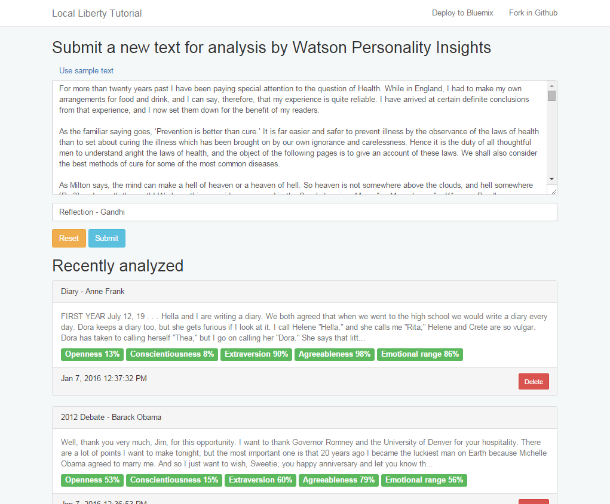
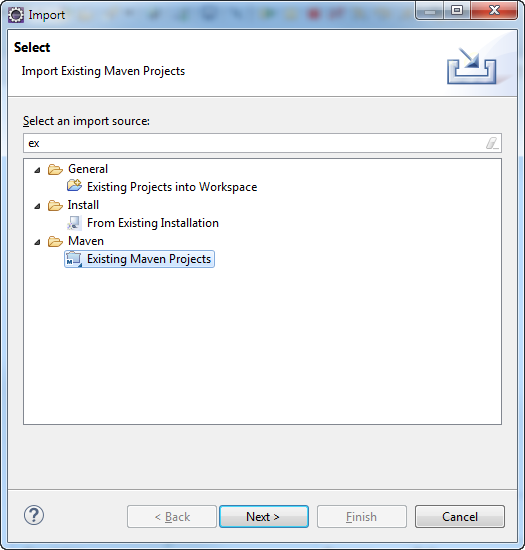
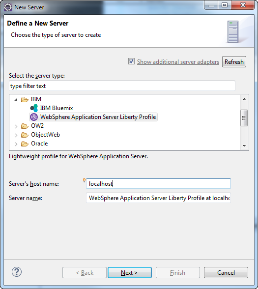
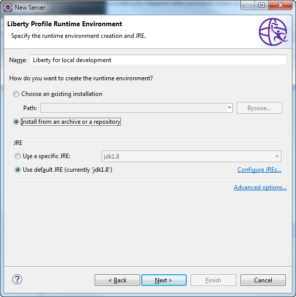
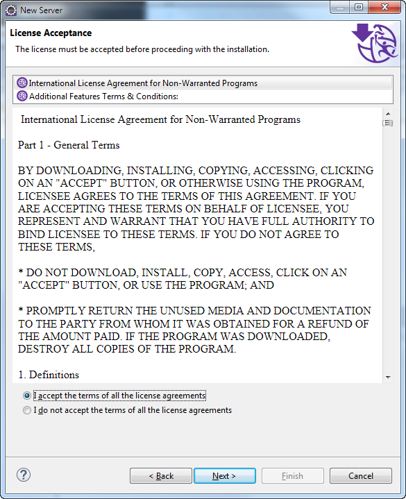
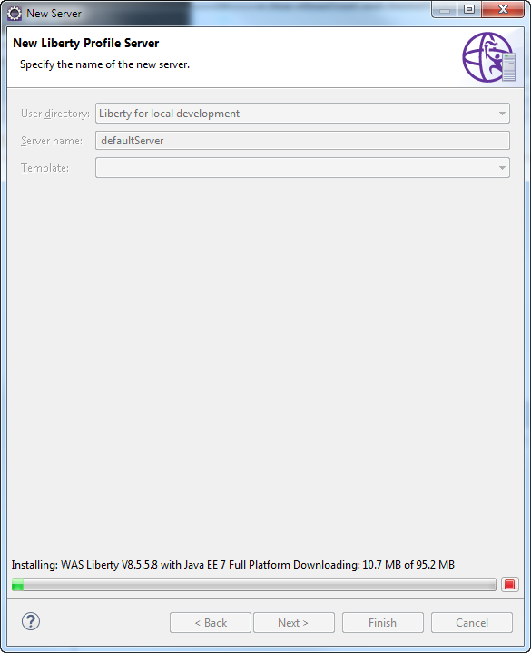
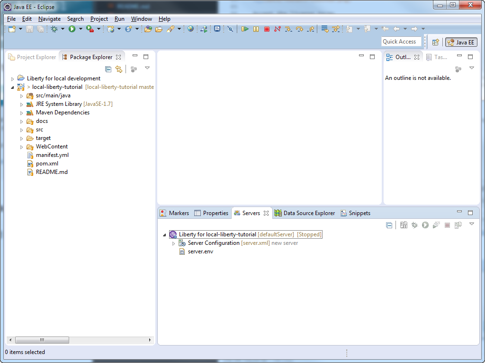
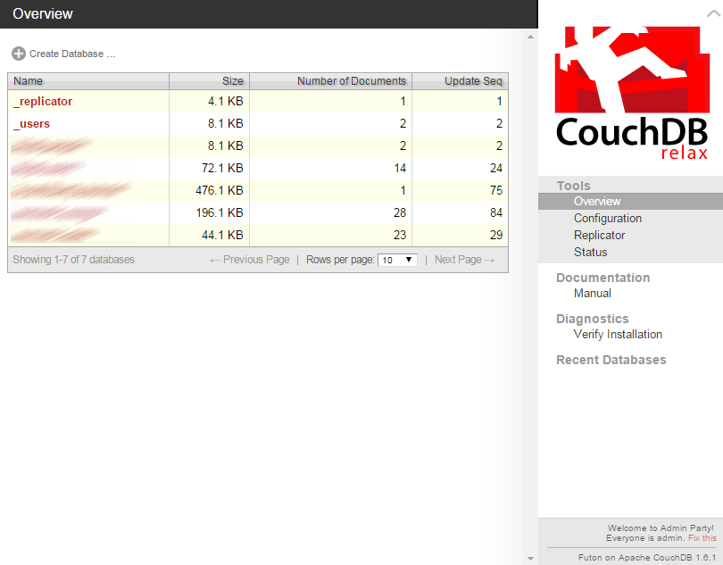
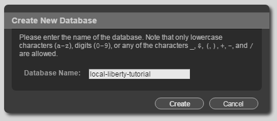
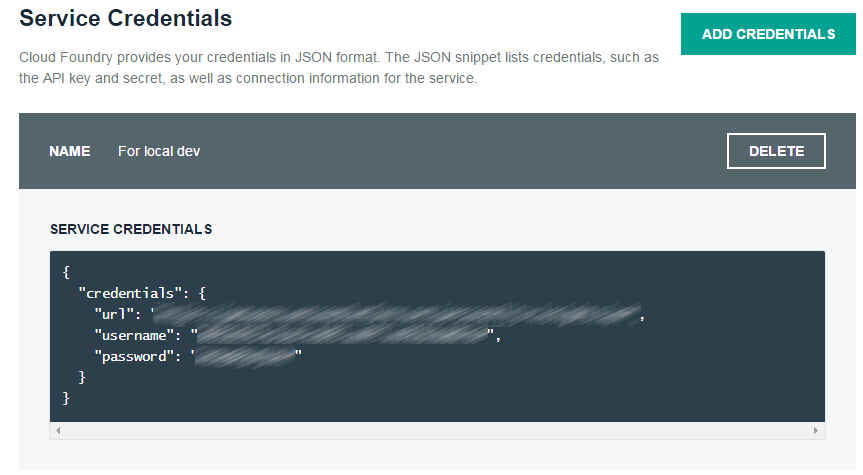

# Tutorial for local development with Liberty for Java™ 

This project provides a walkthrough on how to develop your Liberty application locally on your machine
while using IBM Bluemix services in the cloud or their local equivalents when available.

The sample application uses the following runtime and services:

  * Liberty for Java™
  * Cloudant NoSQL DB
  * Personality Insights
   
In this sample, the user submits a text for analysis, optionally providing a description. The text is sent to Watson Personality Insights and the results are displayed.



In this tutorial, you will:
  * Retrieve a local copy of the source code
  * Configure Eclipse to run the application locally
  * Use a local CouchDB database for persistence
  * Use the Watson Personality Insights service in IBM Bluemix
  * Deploy the application to IBM Bluemix

## Before we start

1. Create a Bluemix Account

  [Sign up][bluemix_signup_url] for Bluemix, or use an existing account.
1. Download and install the [Cloud-foundry CLI][cloud_foundry_url] tool
1. Have your JavaEE development environment ready

The tutorial uses:
  * Eclipse IDE for Java EE developers Mars.1 4.5.1
  * Websphere Application Server Liberty Profile Tools 8.5.5.6
  * Java 8
  * Maven
  * Apache CouchDB
  * [Cloud-foundry CLI][cloud_foundry_url]
  * Git command line

**Let's get started!**

## Configuring the development environment

1. Retrieve the source code on your local machine

  ```
  $ git clone https://github.com/IBM-Bluemix/local-liberty-tutorial.git
  ```

1. Import the project into your development environment.

  For Eclipse, use "Import > Existing Maven Projects". This will automatically generate the right project and classpath files by introspecting the pom.xml

  

1. Create a new Liberty server to host the project.

  In the Eclipse Servers view, create a new server:

  

  Select *IBM / WebSphere Application Server Liberty Profile*:
  * Host name: *localhost*
  * Server name: *Liberty for local-liberty-tutorial*
  
  

  *Note: if this server type is not showing, go to the Eclipse Marketplace to install the Websphere Application Server Liberty Profile Tools first*
  
  Create a new runtime environment:
  * Name: *Liberty for local development*
  * Install from an archive or a repository
  
  
  
  Select the environment options:
  * for Destination path, point to an empty directory. The Libery files will be created right under this directory.
  * Use *Download and install from ibm.com* and select *WAS Liberty V8.5.5.8 with Java EE 7 Full Platform*
  
  

  In the addon, select CouchDB Integration 1.0:
  
  
  
  Accept the license terms
  
  
  
  Name the server

  

  *Note: if this is the first server you create the default is OK. If you develop multiple applications, you may want to create multiple Liberty profiles to isolate the applications from each other and be closer to how you deploy them in the cloud. In such case, naming the profile like the application would be a good option*
  
[bluemix_signup_url]: https://console.ng.bluemix.net/?cm_mmc=GitHubReadMe-_-BluemixSampleApp-_-Node-_-Workflow
[cloud_foundry_url]: https://github.com/cloudfoundry/cli

  Press Finish, sit back and relax. Eclipse is downloading and creating the Liberty runtime followed by the defaultServer profile:

  

  Done!
  
  
  
  The new server is created:
  
  
  
## Install Apache CouchDB

Cloudant is built upon CouchDB. Having your own CouchDB installation makes it very handy to develop locally and deploy  later.

1. Go to [Apache CouchDB](http://couchdb.apache.org/#download) to download and install CouchDB

  *Note: for this tutorial, we use the Windows version 1.6.1 and the installer. The installer creates a Windows service and shortcuts. The Mac OS X version also does a nice job at making it easy to start CouchDB.

1. Start CouchDB

1. Access the CouchDB web interface (running at http://127.0.0.1:5984/_utils/ by default)

  
  
1. Create an admin user and password

  By default everyone is admin. Follow the "fix this" link at the bottom right:

  

1. Create a database named *local-liberty-tutorial*

  

## Configure the Liberty profile to use CouchDB

When you use the Liberty for Java runtime in Bluemix in conjunction with other services, the runtime buildpack is able to automatically wire some of the resources like databases, message queues, monitoring services. It will inject jndi resources, required library JARs, etc. This is referred to as [*Automatic configuration of bound services*](https://www.ng.bluemix.net/docs/starters/liberty/index.html#automaticconfigurationofboundservices) in Liberty for Java documentation. We highly recommended you to read through the Liberty for Java documentation.

We will now configure our local Liberty profile in a similar way done automatically by the buildpack when it finds a Cloudant service bound to your app. There are other approaches such as opting out for automatic configuration of the dependencies and managing them on your own. We will look into those later.

### Update the installed features

1. Back in Eclipse, open the Liberty profile *Server Configuration* [server.xml]:

  

1. Select the *Feature Manager*. By default, the profile came configured with a full profile. For our application we don't need that much so let's update the list:

  * Remove javaee-7.0
  * Add servlet-3.1
  * Add couchdb-1.0
  * Add jndi-1.0

1. Remove the Basic User Registry - we don't need it for our example

  

1. Start the server for a dry-run. The console will show:

  ```
  [AUDIT   ] CWWKZ0058I: Monitoring dropins for applications. 
  [AUDIT   ] CWWKF0012I: The server installed the following features: [servlet-3.1, jndi-1.0, couchdb-1.0].
  [AUDIT   ] CWWKF0011I: The server defaultServer is ready to run a smarter planet.
  ```

1. Stop the server

### Install CouchDB support libraries

For CouchDB, the buildpack uses [Ektorp Java API for CouchDB](http://ektorp.org/). You will find it referenced in the project [pom.xml](pom.xml) too. Ektorp has several dependencies we will need to make available to our Liberty profile so that it can connect to CouchDB.

What are they? For Ektorp 1.4.2, they are:
  * [org.ektorp-1.4.2.jar](http://central.maven.org/maven2/org/ektorp/org.ektorp/1.4.2/org.ektorp-1.4.2.jar)
  * [commons-codec-1.6.jar](http://central.maven.org/maven2/commons-codec/commons-codec/1.6/commons-codec-1.6.jar)
  * [commons-io-2.0.1.jar](http://central.maven.org/maven2/commons-io/commons-io/2.0.1/commons-io-2.0.1.jar)
  * [commons-logging-1.1.3.jar](http://central.maven.org/maven2/commons-logging/commons-logging/1.1.3/commons-logging-1.1.3.jar)
  * [httpclient-4.3.6.jar](http://central.maven.org/maven2/org/apache/httpcomponents/httpclient/4.3.6/httpclient-4.3.6.jar)
  * [httpclient-cache-4.3.6.jar](http://central.maven.org/maven2/org/apache/httpcomponents/httpclient-cache/4.3.6/httpclient-cache-4.3.6.jar)
  * [httpcore-4.3.3.jar](http://central.maven.org/maven2/org/apache/httpcomponents/httpcore/4.3.3/httpcore-4.3.3.jar)
  * [jackson-annotations-2.2.2.jar](http://central.maven.org/maven2/com/fasterxml/jackson/core/jackson-annotations/2.2.2/jackson-annotations-2.2.2.jar)
  * [jackson-core-2.2.2.jar](http://central.maven.org/maven2/com/fasterxml/jackson/core/jackson-core/2.2.2/jackson-core-2.2.2.jar)
  * [jackson-databind-2.2.2.jar](http://central.maven.org/maven2/com/fasterxml/jackson/core/jackson-databind/2.2.2/jackson-databind-2.2.2.jar)
  * [jcl-over-slf4j-1.6.6.jar](http://central.maven.org/maven2/org/slf4j/jcl-over-slf4j/1.6.6/jcl-over-slf4j-1.6.6.jar)
  * [slf4j-api-1.6.6.jar](http://central.maven.org/maven2/org/slf4j/slf4j-api/1.6.6/slf4j-api-1.6.6.jar)
  * [slf4j-jdk14-1.6.6.jar](http://central.maven.org/maven2/org/slf4j/slf4j-jdk14/1.6.6/slf4j-jdk14-1.6.6.jar)

1. Create a new directory named *lib* in the directory of the Liberty profile

1. Download the above JARs into this directory.

  You can use this cURL command to download them all at once. Run it from the newly created *lib* directory

  ```
  /dev/liberty/usr/servers/defaultServer/lib> curl -O http://central.maven.org/maven2/commons-codec/commons-codec/1.6/commons-codec-1.6.jar -O http://central.maven.org/maven2/commons-io/commons-io/2.0.1/commons-io-2.0.1.jar -O http://central.maven.org/maven2/commons-logging/commons-logging/1.1.3/commons-logging-1.1.3.jar -O http://central.maven.org/maven2/org/apache/httpcomponents/httpclient/4.3.6/httpclient-4.3.6.jar -O http://central.maven.org/maven2/org/apache/httpcomponents/httpclient-cache/4.3.6/httpclient-cache-4.3.6.jar -O http://central.maven.org/maven2/org/apache/httpcomponents/httpcore/4.3.3/httpcore-4.3.3.jar -O http://central.maven.org/maven2/com/fasterxml/jackson/core/jackson-annotations/2.2.2/jackson-annotations-2.2.2.jar -O http://central.maven.org/maven2/com/fasterxml/jackson/core/jackson-core/2.2.2/jackson-core-2.2.2.jar -O http://central.maven.org/maven2/com/fasterxml/jackson/core/jackson-databind/2.2.2/jackson-databind-2.2.2.jar -O http://central.maven.org/maven2/org/slf4j/jcl-over-slf4j/1.6.6/jcl-over-slf4j-1.6.6.jar -O http://central.maven.org/maven2/org/ektorp/org.ektorp/1.4.2/org.ektorp-1.4.2.jar -O http://central.maven.org/maven2/org/slf4j/slf4j-api/1.6.6/slf4j-api-1.6.6.jar -O http://central.maven.org/maven2/org/slf4j/slf4j-jdk14/1.6.6/slf4j-jdk14-1.6.6.jar
  ```

### Create a CouchDB database
  
1. Back in Eclipse, open the Liberty profile *Server Configuration* [server.xml]:

1. Switch to *Source* tab

1. Copy and paste the following at the end of the file before the closing *server* tag:

  ```
  <couchdb id="cloudant-for-liberty"
           jndiName="couchdb/cloudant-for-liberty"
           libraryRef="cloudantNoSQLDB-library"
           host="localhost"
           port="5984"
           username="changeme"
           password="changeme"
           enableSSL="false"/>
  <library id="cloudantNoSQLDB-library">
    <fileset dir="${server.config.dir}/lib" id="cloudantNoSQLDB-fileset" includes="commons-codec-1.6.jar commons-io-2.0.1.jar commons-logging-1.1.3.jar httpclient-4.3.6.jar httpclient-cache-4.3.6.jar httpcore-4.3.3.jar jackson-annotations-2.2.2.jar jackson-core-2.2.2.jar jackson-databind-2.2.2.jar jcl-over-slf4j-1.6.6.jar org.ektorp-1.4.2.jar slf4j-api-1.6.6.jar slf4j-jdk14-1.6.6.jar"/>
  </library>
  ```
  
  
  
1. Replace the values for username and password with the one you defined earlier in CouchDB web interface.

## Add the application to the server

1. Right-click on the server in the Servers view, select *Add and Remove...*

1. Add *local-liberty-tutorial* and click Finish

  
  
1. In server.xml, a new webApplication is added. We need to reference the *cloudantNoSQLDB-library* in this webapp so that it can access the CouchDB libraries. Edit server.xml and change the definition of the webApplication from

  ```
  <webApplication id="local-liberty-tutorial" location="local-liberty-tutorial.war" name="local-liberty-tutorial"/>
  ```

  to:

  ```
  <webApplication id="local-liberty-tutorial" location="local-liberty-tutorial.war" name="local-liberty-tutorial">
    <classloader commonLibraryRef="cloudantNoSQLDB-library">
    </classloader>
  </webApplication>
  ```

## Run the application

1. Start the server.

  ```
  Launching defaultServer (WebSphere Application Server 8.5.5.8/wlp-1.0.11.cl50820151201-1942) on Java HotSpot(TM) Client VM, version 1.8.0_60-b27 (en_US)
  [AUDIT   ] CWWKE0001I: The server defaultServer has been launched.
  [AUDIT   ] CWWKE0100I: This product is licensed for development, and limited production use. The full license terms can be viewed here:   https://public.dhe.ibm.com/ibmdl/export/pub/software/websphere/wasdev/license/base_ilan/ilan/8.5.5.8/lafiles/en.html
  [AUDIT   ] CWWKZ0058I: Monitoring dropins for applications. 
  [AUDIT   ] CWWKT0016I: Web application available (default_host): http://localhost:9080/local-liberty-tutorial/
  [AUDIT   ] CWWKZ0001I: Application local-liberty-tutorial started in 1.238 seconds.
  [AUDIT   ] CWWKF0012I: The server installed the following features: [jsp-2.3, servlet-3.1, jsf-2.2, jndi-1.0, json-1.0, couchdb-1.0, localConnector-1.0, jaxrs-2.0, el-3.0, jaxrsClient-2.0].
  [AUDIT   ] CWWKF0011I: The server defaultServer is ready to run a smarter planet.
  ```

1. Access the running application through the link is shown in the Liberty console. The application is displayed. No error in the Liberty console

  

## Add Personality Insights

We are almost there. Our application is running, it is bound to a database. The fact is displayed without errors confirm it was able to talk with CouchDB to retrieve an empty list of elements.

But it is missing a core piece: the Personality Insights service. For this one, there is no equivalent. Ideally we would create a mock service so that we can work offline on other pieces of the application but here we are gonna look at how we can have our local application connect to a Personality Insights service running in IBM Bluemix.

So let's create a new Personality Insights service in Bluemix using the user interface or the command line and retrieve the credentials we will need to use to call the service.

### Provision a Personality Insights service from the Bluemix console

1. Connect to the Bluemix console

1. In the catalog, select Personality Insights

1. Set the service name to *pi-for-liberty* and click Create

  

1. Select the service in the Bluemix dashboard
   * Go to *Service Credentials*
   * Click *Add Credentials*
   * Set the name to *For local dev*

  

  We will use them soon.

### Or provision a Personality Insights service from the command-line

1. Create the Personality Insights service in Bluemix 

  ```
  $ cf create-service personality_insights tiered pi-for-liberty
  ```

1. Create a new set of credentials

  ```
  $ cf create-service-key pi-for-liberty "For local dev"
  Creating service key For local dev for service instance pi-for-liberty as user@domain...
  OK
  ```
  
1. Retrieve the credentials

  ```
  $ cf service-key pi-for-liberty "For local dev"
  Getting key For local dev for service instance pi-for-liberty as user@domain..
  
  {
    "password": "cr01Nv3fdf",
    "url": "https://gateway.watsonplatform.net/personality-insights/api",
    "username": "1e42D6-2533-4455-8536-20cbd4545456"
  }
  ```
