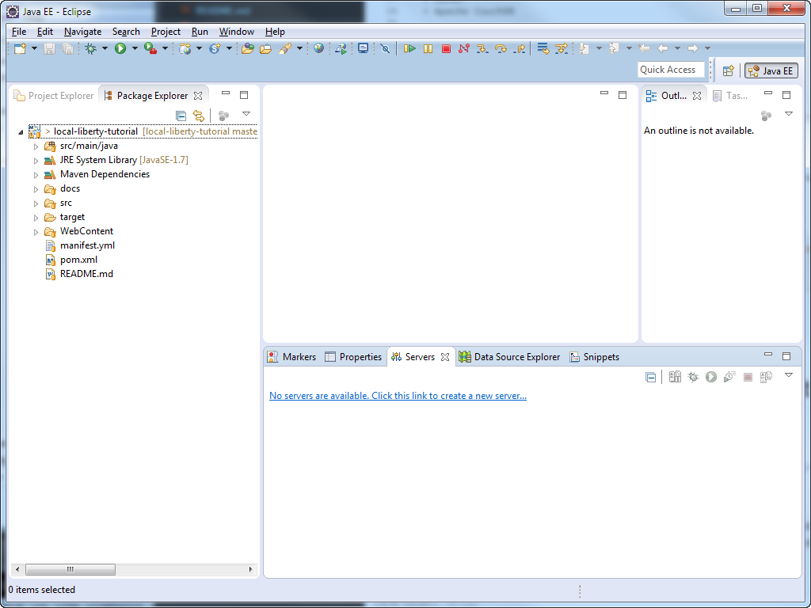
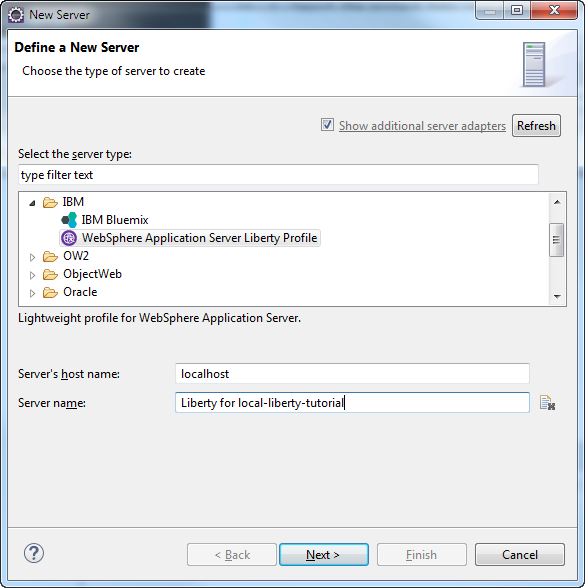
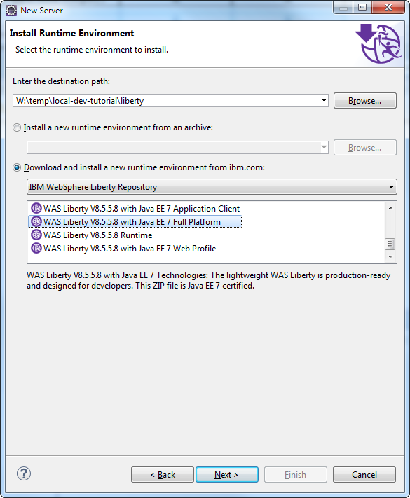
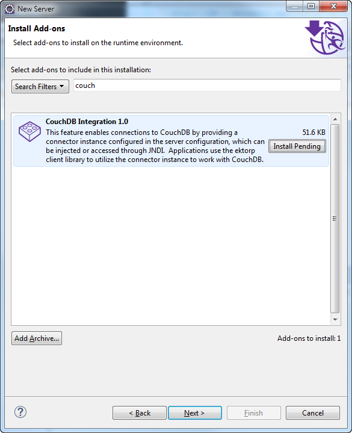
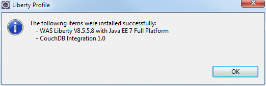

## Create a Liberty profile

1. Create a new Liberty server to host the project.

  In the Eclipse Servers view, create a new server:

  

1. Select *IBM / WebSphere Application Server Liberty Profile*:
  * Host name: *localhost*
  * Server name: *Liberty for local-liberty-tutorial*
  
  

  *Note: if this server type is not showing, go to the Eclipse Marketplace to install the Websphere Application Server Liberty Profile Tools.*
  
1. Create a new runtime environment:
  * Name: *Liberty for local development*
  * Install from an archive or a repository
  
  
  
1. Select the environment options:
  * for Destination path, point to an empty directory. The Libery files will be created right under this directory.
  * Use *Download and install from ibm.com* and select *WAS Liberty V8.5.5.8 with Java EE 7 Full Platform*
  
  

1. In the addon, select CouchDB Integration 1.0:
  
  
  
1. Accept the license terms
  
  
  
1. Name the server

  

  *Note: if this is the first server you create the default is OK.
  If you develop multiple applications, you may want to create multiple Liberty profiles to isolate
  the applications from each other and be closer to how you deploy them in the cloud. In such case,
  naming the profile like the application would be a good option*

1. Press Finish, sit back and relax. Eclipse is downloading and creating the Liberty runtime followed by the defaultServer profile:

  

1. Done!
  
  
  
  The new server is created:
  
  

---

Proceed to the [next step](003-COUCHDB.md).