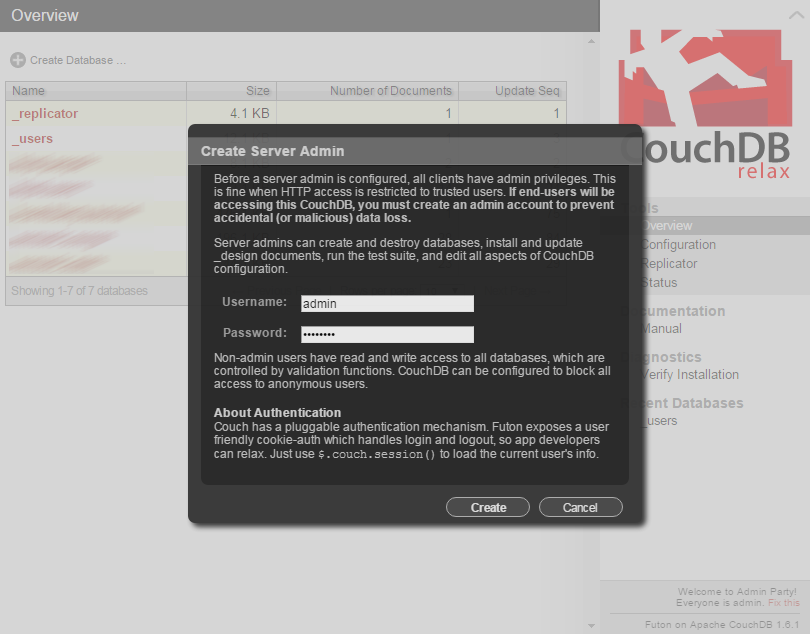

## Install Apache CouchDB

Cloudant is built upon CouchDB. Having your own CouchDB installation makes it very handy to develop locally and deploy  later.

1. Go to [Apache CouchDB](http://couchdb.apache.org/#download) to download and install CouchDB

  *Note: for this tutorial, we use the Windows version 1.6.1 and the installer. The installer creates a Windows service and shortcuts. The Mac OS X version also does a nice job at making it easy to start CouchDB.

1. Start CouchDB

1. Access the CouchDB web interface (running at http://127.0.0.1:5984/_utils/ by default)

  
  
1. Create an admin user and password

  By default everyone is admin. Follow the "fix this" link at the bottom right:

  

1. Create a database named *local-liberty-tutorial*

  
