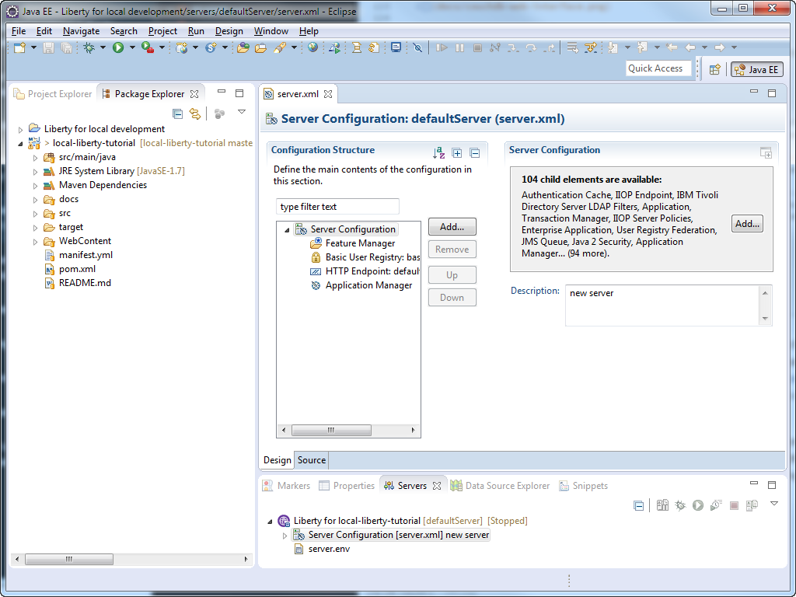
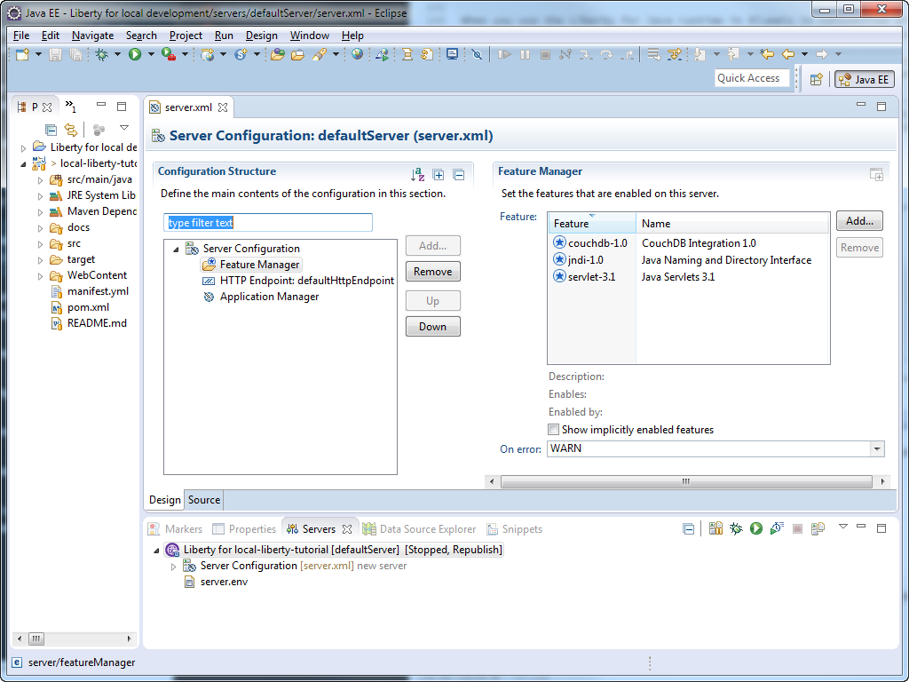
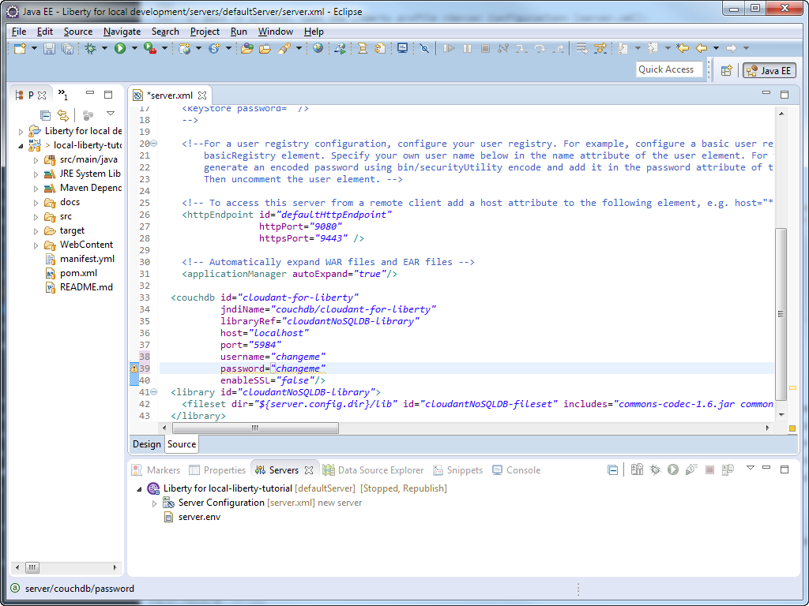

## Configure the Liberty profile to use CouchDB

When you use the Liberty for Java runtime in Bluemix in conjunction with other services, the runtime buildpack is able to automatically wire some of the resources like databases, message queues, monitoring services. It will inject jndi resources, required library JARs, etc. This is referred to as [*Automatic configuration of bound services*](https://www.ng.bluemix.net/docs/starters/liberty/index.html#automaticconfigurationofboundservices) in Liberty for Java documentation. We highly recommended you to read through the Liberty for Java documentation.

We will now configure our local Liberty profile in a similar way done automatically by the buildpack when it finds a Cloudant service bound to your app. There are other approaches such as opting out for automatic configuration of the dependencies and managing them on your own. We will look into those later.

### Update the installed features

1. Back in Eclipse, open the Liberty profile *Server Configuration* [server.xml]:

  

1. Select the *Feature Manager*. By default, the profile came configured with a full profile. For our application we don't need that much so let's update the list:

  * Remove javaee-7.0
  * Add servlet-3.1
  * Add couchdb-1.0
  * Add jndi-1.0

1. Remove the Basic User Registry - we don't need it for our example

  

1. Start the server for a dry-run. The console will show:

  ```
  [AUDIT   ] CWWKZ0058I: Monitoring dropins for applications. 
  [AUDIT   ] CWWKF0012I: The server installed the following features: [servlet-3.1, jndi-1.0, couchdb-1.0].
  [AUDIT   ] CWWKF0011I: The server defaultServer is ready to run a smarter planet.
  ```

1. Stop the server

### Install CouchDB support libraries

For CouchDB, the buildpack uses [Ektorp Java API for CouchDB](http://ektorp.org/). You will find it referenced in the project [pom.xml](pom.xml) too. Ektorp has several dependencies we will need to make available to our Liberty profile so that it can connect to CouchDB.

What are they? For Ektorp 1.4.2, they are:
  * [org.ektorp-1.4.2.jar](http://central.maven.org/maven2/org/ektorp/org.ektorp/1.4.2/org.ektorp-1.4.2.jar)
  * [commons-codec-1.6.jar](http://central.maven.org/maven2/commons-codec/commons-codec/1.6/commons-codec-1.6.jar)
  * [commons-io-2.0.1.jar](http://central.maven.org/maven2/commons-io/commons-io/2.0.1/commons-io-2.0.1.jar)
  * [commons-logging-1.1.3.jar](http://central.maven.org/maven2/commons-logging/commons-logging/1.1.3/commons-logging-1.1.3.jar)
  * [httpclient-4.3.6.jar](http://central.maven.org/maven2/org/apache/httpcomponents/httpclient/4.3.6/httpclient-4.3.6.jar)
  * [httpclient-cache-4.3.6.jar](http://central.maven.org/maven2/org/apache/httpcomponents/httpclient-cache/4.3.6/httpclient-cache-4.3.6.jar)
  * [httpcore-4.3.3.jar](http://central.maven.org/maven2/org/apache/httpcomponents/httpcore/4.3.3/httpcore-4.3.3.jar)
  * [jackson-annotations-2.2.2.jar](http://central.maven.org/maven2/com/fasterxml/jackson/core/jackson-annotations/2.2.2/jackson-annotations-2.2.2.jar)
  * [jackson-core-2.2.2.jar](http://central.maven.org/maven2/com/fasterxml/jackson/core/jackson-core/2.2.2/jackson-core-2.2.2.jar)
  * [jackson-databind-2.2.2.jar](http://central.maven.org/maven2/com/fasterxml/jackson/core/jackson-databind/2.2.2/jackson-databind-2.2.2.jar)
  * [jcl-over-slf4j-1.6.6.jar](http://central.maven.org/maven2/org/slf4j/jcl-over-slf4j/1.6.6/jcl-over-slf4j-1.6.6.jar)
  * [slf4j-api-1.6.6.jar](http://central.maven.org/maven2/org/slf4j/slf4j-api/1.6.6/slf4j-api-1.6.6.jar)
  * [slf4j-jdk14-1.6.6.jar](http://central.maven.org/maven2/org/slf4j/slf4j-jdk14/1.6.6/slf4j-jdk14-1.6.6.jar)

1. Create a new directory named *lib* in the directory of the Liberty profile

1. Download the above JARs into this directory.

  You can use this cURL command to download them all at once. Run it from the newly created *lib* directory

  ```
  /dev/liberty/usr/servers/defaultServer/lib> curl -O http://central.maven.org/maven2/commons-codec/commons-codec/1.6/commons-codec-1.6.jar -O http://central.maven.org/maven2/commons-io/commons-io/2.0.1/commons-io-2.0.1.jar -O http://central.maven.org/maven2/commons-logging/commons-logging/1.1.3/commons-logging-1.1.3.jar -O http://central.maven.org/maven2/org/apache/httpcomponents/httpclient/4.3.6/httpclient-4.3.6.jar -O http://central.maven.org/maven2/org/apache/httpcomponents/httpclient-cache/4.3.6/httpclient-cache-4.3.6.jar -O http://central.maven.org/maven2/org/apache/httpcomponents/httpcore/4.3.3/httpcore-4.3.3.jar -O http://central.maven.org/maven2/com/fasterxml/jackson/core/jackson-annotations/2.2.2/jackson-annotations-2.2.2.jar -O http://central.maven.org/maven2/com/fasterxml/jackson/core/jackson-core/2.2.2/jackson-core-2.2.2.jar -O http://central.maven.org/maven2/com/fasterxml/jackson/core/jackson-databind/2.2.2/jackson-databind-2.2.2.jar -O http://central.maven.org/maven2/org/slf4j/jcl-over-slf4j/1.6.6/jcl-over-slf4j-1.6.6.jar -O http://central.maven.org/maven2/org/ektorp/org.ektorp/1.4.2/org.ektorp-1.4.2.jar -O http://central.maven.org/maven2/org/slf4j/slf4j-api/1.6.6/slf4j-api-1.6.6.jar -O http://central.maven.org/maven2/org/slf4j/slf4j-jdk14/1.6.6/slf4j-jdk14-1.6.6.jar
  ```

### Create a CouchDB database
  
1. Back in Eclipse, open the Liberty profile *Server Configuration* [server.xml]:

1. Switch to *Source* tab

1. Copy and paste the following at the end of the file before the closing *server* tag:

  ```
  <couchdb id="cloudant-for-liberty"
           jndiName="couchdb/cloudant-for-liberty"
           libraryRef="cloudantNoSQLDB-library"
           host="localhost"
           port="5984"
           username="changeme"
           password="changeme"
           enableSSL="false"/>
  <library id="cloudantNoSQLDB-library">
    <fileset dir="${server.config.dir}/lib" id="cloudantNoSQLDB-fileset" includes="commons-codec-1.6.jar commons-io-2.0.1.jar commons-logging-1.1.3.jar httpclient-4.3.6.jar httpclient-cache-4.3.6.jar httpcore-4.3.3.jar jackson-annotations-2.2.2.jar jackson-core-2.2.2.jar jackson-databind-2.2.2.jar jcl-over-slf4j-1.6.6.jar org.ektorp-1.4.2.jar slf4j-api-1.6.6.jar slf4j-jdk14-1.6.6.jar"/>
  </library>
  ```
  
  
  
1. Replace the values for username and password with the one you defined earlier in CouchDB web interface.
