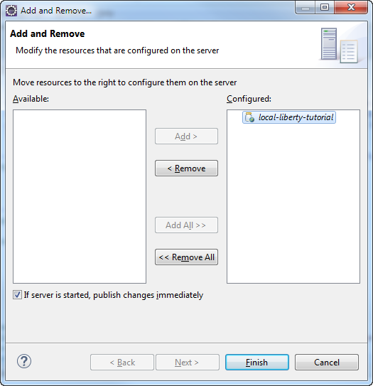
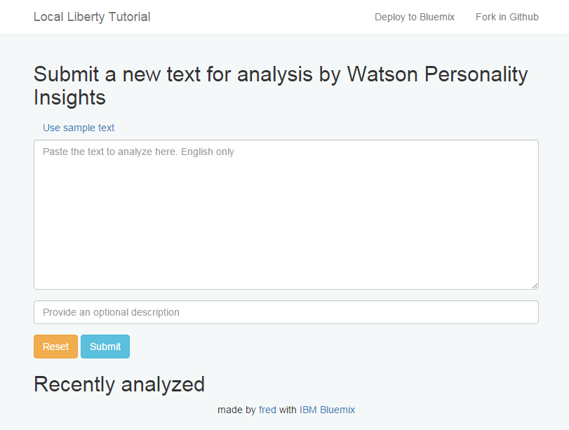

## Test Liberty and CouchDB configuration

1. Right-click on the server in the *Servers* view and select *Add and Remove...*

1. Add *local-liberty-tutorial* and click Finish

  
  
1. In server.xml, a new *webApplication* is added.
We need to reference the *cloudantNoSQLDB-library* defined in the previous step
in this webapp so that the application can access the CouchDB libraries.
Edit *server.xml* and change the definition of the webApplication from

  ```
  <webApplication id="local-liberty-tutorial" location="local-liberty-tutorial.war" name="local-liberty-tutorial"/>
  ```

  to:

  ```
  <webApplication id="local-liberty-tutorial" location="local-liberty-tutorial.war" name="local-liberty-tutorial">
    <classloader commonLibraryRef="cloudantNoSQLDB-library">
    </classloader>
  </webApplication>
  ```

### Run the application

1. Start the server.

  ```
  Launching defaultServer (WebSphere Application Server 8.5.5.8/wlp-1.0.11.cl50820151201-1942) on Java HotSpot(TM) Client VM, version 1.8.0_60-b27 (en_US)
  [AUDIT   ] CWWKE0001I: The server defaultServer has been launched.
  [AUDIT   ] CWWKE0100I: This product is licensed for development, and limited production use. The full license terms can be viewed here:   https://public.dhe.ibm.com/ibmdl/export/pub/software/websphere/wasdev/license/base_ilan/ilan/8.5.5.8/lafiles/en.html
  [AUDIT   ] CWWKZ0058I: Monitoring dropins for applications. 
  [AUDIT   ] CWWKT0016I: Web application available (default_host): http://localhost:9080/local-liberty-tutorial/
  [AUDIT   ] CWWKZ0001I: Application local-liberty-tutorial started in 1.238 seconds.
  [AUDIT   ] CWWKF0012I: The server installed the following features: [jsp-2.3, servlet-3.1, jsf-2.2, jndi-1.0, json-1.0, couchdb-1.0, localConnector-1.0, jaxrs-2.0, el-3.0, jaxrsClient-2.0].
  [AUDIT   ] CWWKF0011I: The server defaultServer is ready to run a smarter planet.
  ```

1. Access the web application through the link shown in the Liberty console.
The application is displayed.
No error in the Liberty console.

  

  We are almost there. Our application is running, it is bound to the database.
  The fact it displayed without errors confirm it was able to talk with CouchDB
  to retrieve the (empty) list of elements.

1. Stop the server

---

Proceed to the [next step](006-PI.md).
